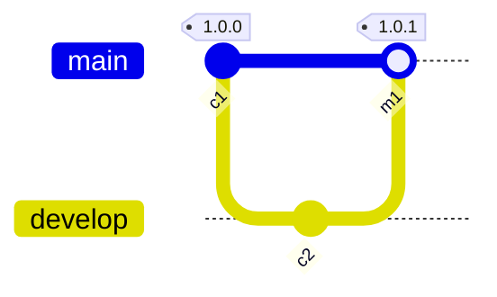
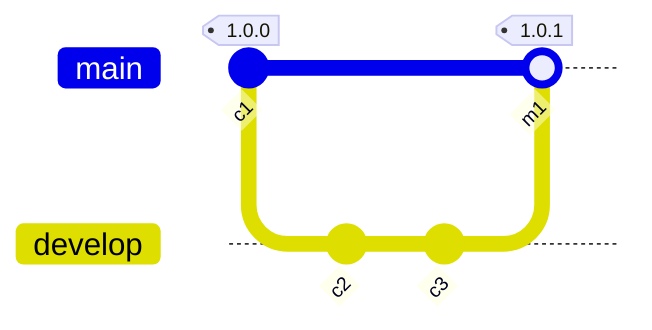
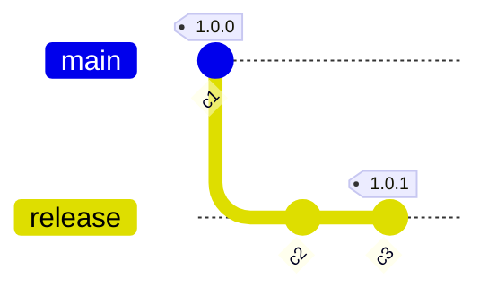
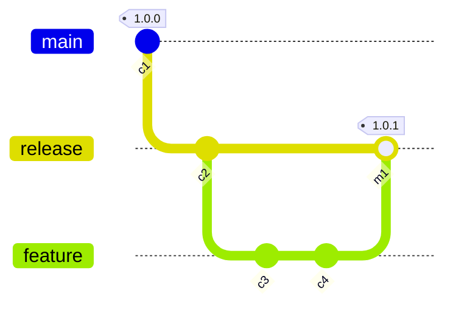
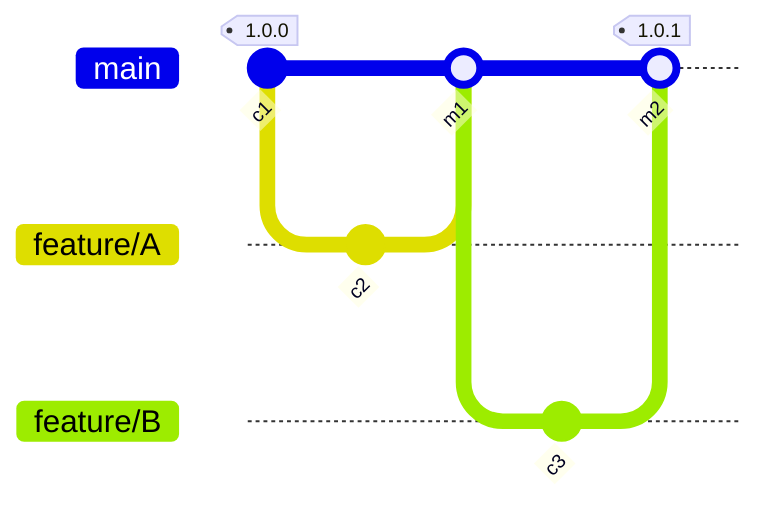

# S1: Committer is not a reviewer

#### Given

- Alice is a committer
- and Bob is a reviewer
- and tag `1.0.0` is a trusted baseline

#### When

- Alice commits `c2` on `develop`
- and Alice creates a pull request
- and Bob approves and merges the pull request, creating merge commit `m1`

#### Then

- The control passes for changes from `1.0.0` to `1.0.1` tags

# S2: Committer is a reviewer

#### Given

- Alice is a committer and a reviewer
- and tag `1.0.0` is a trusted baseline

#### When

- Alice commits `c2` on `develop`
- and Alice creates a pull request
- and Alice approves and merges the pull request, creating merge commit `m1`

#### Then

- The control fails for changes from `1.0.0` to `1.0.1` tags

# S2: 2 Committers and both approve

#### Given

- Alice is a committer and a reviewer
- and Bob is a committer and a reviewer
- and tag `1.0.0` is a trusted baseline

#### When

- Alice commits `c2` on `develop`
- and Bob commits `c3` on `develop`
- and Bob raises a pull request for `c3` to be merged into `main`
- and Alice approves the pull request
- and Bob approves the pull request
- and Bob merges the pull request

#### Then

- The control passes for changes from `1.0.0` to `1.0.1` tags

# S4: 2 Committers and only one of them approves

#### Given

- Alice is a committer
- and Bob is a committer
- and tag `1.0.0` is a trusted baseline

#### When

- Alice commits `c2` on `develop`
- and Bob commits `c3` on `develop`
- and Bob raises a pull request for `c3` to be merged into `main`
- and only Bob approves the pull request
- and Bob merges the pull request

#### Then

- The control fails for changes from `1.0.0` to `1.0.1` tags because `c3` has not had a 4-eye review

 
# S5: Commits without PR

#### Given

- Alice is a committer
- and tag `1.0.0` is a trusted baseline

#### When

- Alice commits `c2` and `c3` on `release`

#### Then

- The control fails for changes from `1.0.0` to `1.0.1` tags

# S6: Direct commit on release branch

#### Given

- Alice is a committer
- and Bob is a reviewer
- and tag `1.0.0` is a trusted baseline

#### When

- Alice commits `c2` on `release`
- and Alice commits `c3` and `c4` on `feature`
- and Alice raises a pull request for `feature` to be merged into `release`
- and Bob approves and merges the pull request, creating tag `1.0.1`

#### Then

- The control fails for changes from `1.0.0` to `1.0.1` tags, since `c2` has not had a 4-eye review

# S7: 2 PRs with reviewers different from committers

#### Given

- Alice is a committer and an approver
- and Bob is a reviewer and an approver
- and tag `1.0.0` is a trusted baseline

#### When

- Alice commits `c2` on `feature/A`
- and Alice raises a pull request for `feature/A` to be merged into `main`
- and Bob approves and merges the pull request, creating merge commit `m1`
- and Bob commits `c3` on `feature/B`
- and Bob raises a pull request for `feature/B` to be merged into `main`
- and Alice approves and merges the pull request, creating merge commit `m2`

#### Then

- The control passes for changes from `1.0.0` to `1.0.1` tags

# S8: 2 PRs where one has reviewer being the committer 

#### Given

- Alice is a committer and an approver
- and Bob is a reviewer and an approver
- and tag `1.0.0` is a trusted baseline

#### When

- Alice commits `c2` on `feature/A`
- and Alice raises a pull request for `feature/A` to be merged into `main`
- and Bob approves and merges the pull request, creating merge commit `m1`
- and Bob commits `c3` on `feature/B`
- and Bob raises a pull request for `feature/B` to be merged into `main`
- and Bob approves and merges the pull request, creating merge commit `m2`

#### Then

- The control fails for changes from `1.0.0` to `1.0.1` tags, since `c3` has not had a 4-eye review

