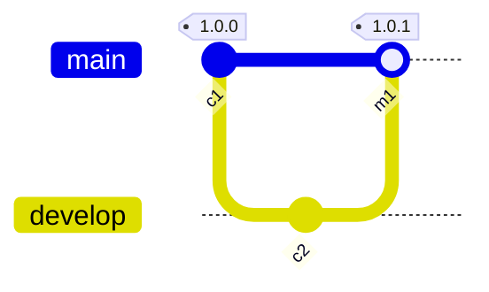
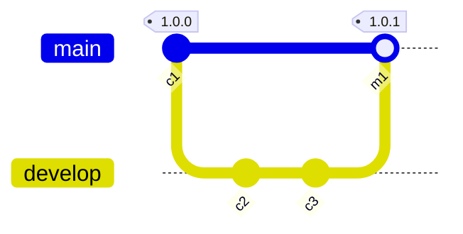
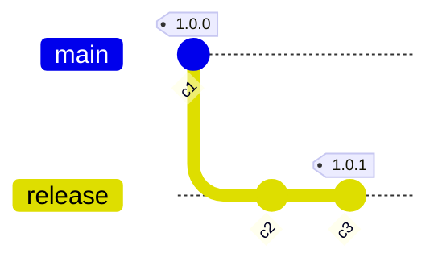
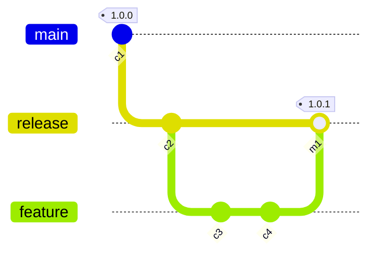
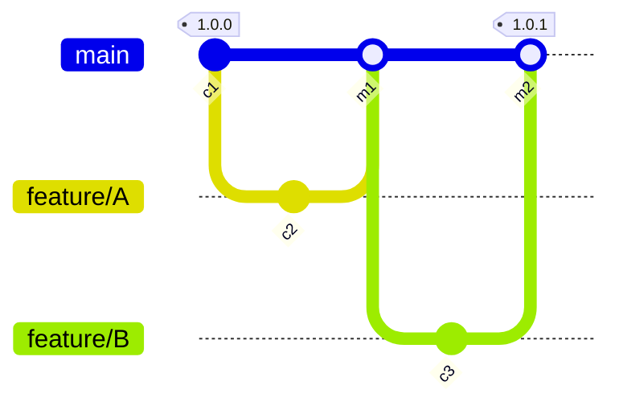

# S1: Approver is not a committer

#### Given

- Sami is a committer
- and Faye is an approver
- and tag `1.0.0` is a trusted baseline from commit `c1`

#### When

- Sami commits `c2` on `develop`
- and Sami creates a pull request
- and Faye approves and merges the pull request, creating merge commit `m1`

#### Then

- The control passes for changes from `1.0.0` to `1.0.1` tags

# S2: Committer is the only Approver

#### Given

- Sami is a committer and an approver
- and tag `1.0.0` is a trusted baseline from commit `c1`

#### When

- Sami commits `c2` on `develop`
- and Faye creates a pull request
- and Sami approves and merges the pull request, creating merge commit `m1`

#### Then

- The control fails for changes from `1.0.0` to `1.0.1` tags

# S3: Two Committers and both approve

#### Given

- Sami is a committer and an approver
- and Faye is a committer and an approver
- and tag `1.0.0` is a trusted baseline from commit `c1`

#### When

- Sami commits `c2` on `develop`
- and Faye commits `c3` on `develop`
- and Steve raises a pull request for `c3` to be merged into `main`
- and Sami approves the pull request
- and Faye approves and merges the pull request, creating merge commit `m1`

#### Then

- The control passes for changes from `1.0.0` to `1.0.1` tags

# S4: Two Committers and only one of them approves

#### Given

- Sami is a committer
- and Faye is a committer and an approver
- and tag `1.0.0` is a trusted baseline from commit `c1`

#### When

- Sami commits `c2` on `develop`
- and Faye commits `c3` on `develop`
- and Steve raises a pull request for `c3` to be merged into `main`
- and Faye approves and merges the pull request, creating merge commit `m1`

#### Then

- The control fails for changes from `1.0.0` to `1.0.1` tags because `c3` has not had a 4-eye review

 
# S5: Commits without PR on release branch

#### Given

- Sami is a committer
- and tag `1.0.0` is a trusted baseline

#### When

- Sami commits `c2` and `c3` on `release`

#### Then

- The control fails for changes from `1.0.0` to `1.0.1` tags

# S6: Direct commit on a branch, before branching from that commit to make a PR

#### Given

- Sami is a committer
- and Faye is an approver
- and tag `1.0.0` is a trusted baseline

#### When

- Sami commits `c2` on `release`
- and Sami commits `c3` and `c4` on `feature` branched from `c2`
- and Sami raises a pull request for `feature` to be merged into `release`
- and Faye approves and merges the pull request, creating tag `1.0.1`

#### Then

- The control fails for changes from `1.0.0` to `1.0.1` tags, since `c2` has not had a 4-eye review

# S7: Two PRs with approvers different from committers

#### Given

- Sami is a committer and an approver
- and Faye is a committer and an approver
- and tag `1.0.0` is a trusted baseline

#### When

- Sami commits `c2` on `feature/A`
- and Sami raises a pull request for `feature/A` to be merged into `main`
- and Faye approves and merges the pull request, creating merge commit `m1`
- and Faye commits `c3` on `feature/B`
- and Faye raises a pull request for `feature/B` to be merged into `main`
- and Sami approves and merges the pull request, creating merge commit `m2`

#### Then

- The control passes for changes from `1.0.0` to `1.0.1` tags

# S8: Two PRs where one is not-compliant because only approver is the committer 

#### Given

- Sami is a committer and an approver
- and Faye is a committer and an approver
- and tag `1.0.0` is a trusted baseline

#### When

- Sami commits `c2` on `feature/A`
- and Sami raises a pull request for `feature/A` to be merged into `main`
- and Faye approves and merges the pull request, creating merge commit `m1`
- and Faye commits `c3` on `feature/B`
- and Steve raises a pull request for `feature/B` to be merged into `main`
- and Faye approves and merges the pull request, creating merge commit `m2`

#### Then

- The control fails for changes from `1.0.0` to `1.0.1` tags, since `c3` has not had a 4-eye review

